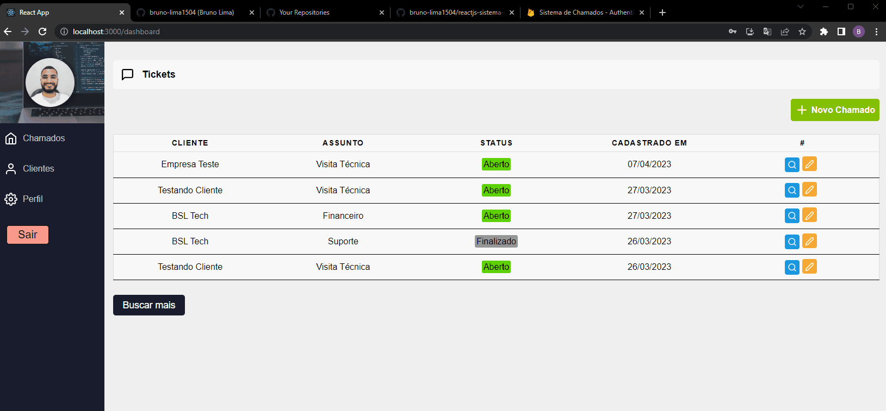
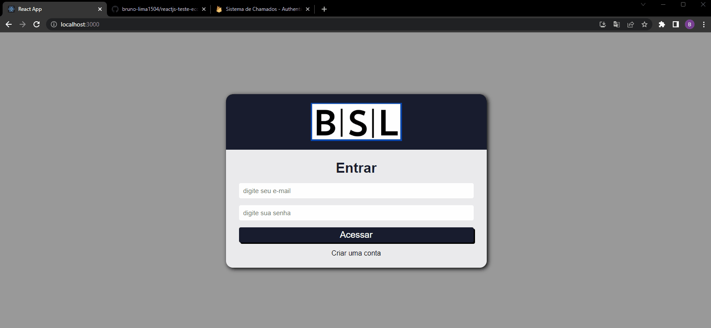
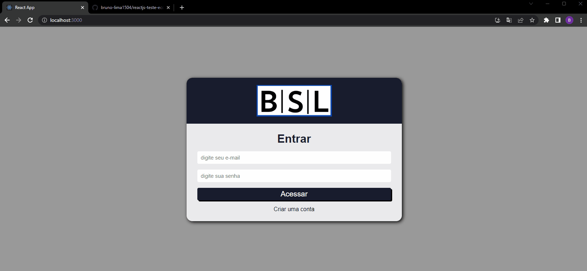
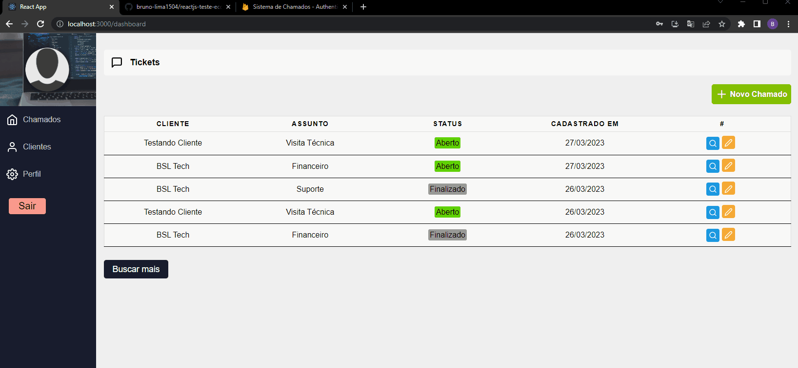
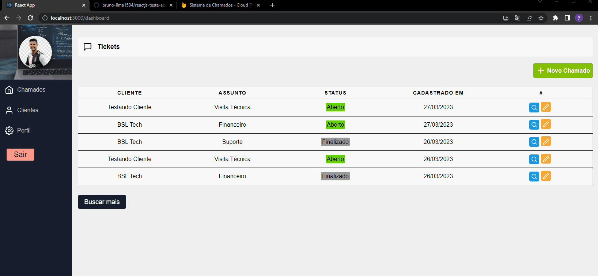
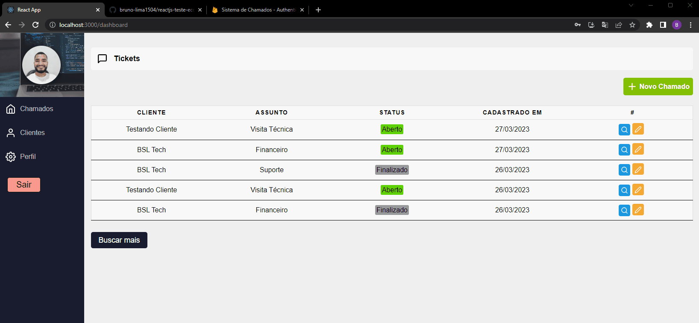
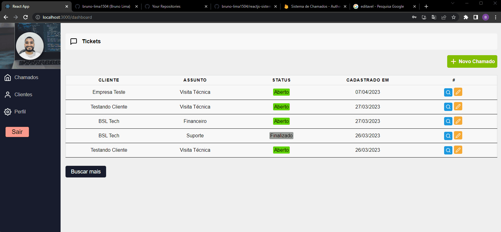

# Sitema de Chamados - ReactJs

## Deploy da Aplicação:

> Link do deploy da aplicação: https://reactjs-sistema-de-chamados.vercel.app/

### Tópicos 

* [Sobre](#Sobre)

* [Funcionalidades](#funcionalidades)

* [Funcionalidades futuras](#funcionalidades-futuras)

* [Desenvolvido por:](#desenvolvido-por)

## Sobre:
Bem-vindo ao projeto de um sistema de chamados com o frontend desenvolvido em ReactJS e o backend desenvolvido em NoSQL utilizando Firebase. O objetivo deste projeto é desenvolver um sistema eficiente e escalável para gerenciar chamados e solicitações de suporte de maneira organizada e simplificada.

O ReactJS é uma biblioteca JavaScript popular e de código aberto utilizada para construir interfaces de usuário (UI) para aplicativos da web. Ele fornece uma maneira fácil de criar componentes reutilizáveis e permite atualizar apenas as partes necessárias da UI em vez de renderizar a página inteira a cada alteração.

O Firebase, por outro lado, é uma plataforma de desenvolvimento de aplicativos móveis e web da Google que oferece uma ampla gama de recursos, incluindo hospedagem de aplicativos, armazenamento em nuvem, autenticação de usuários, análise de dados e muito mais. Para o nosso projeto, usaremos o Firestore, o banco de dados NoSQL do Firebase, que fornece uma estrutura escalável e flexível para armazenar dados.

Combinando essas tecnologias, podemos construir um sistema de chamados que seja rápido, seguro e fácil de usar. O ReactJS nos permitirá criar uma UI intuitiva e responsiva para os usuários, enquanto o Firebase nos permitirá armazenar e gerenciar os dados do sistema de forma eficiente.

Ao longo deste projeto, foi trabalhado etapas para desenvolver cada parte do sistema, desde o design do banco de dados até a criação dos componentes ReactJS. No final, temos um sistema de chamados completamente funcional que poderá ser estendido e aprimorado posteriormente conforme necessário.

## Funcionalidades:
O projeto conta coma as bibliotecas:

    - react-icons
    - react-router-dom
    - react-toastify
    - firebase
    - styled-components

Você pode criar um usuário, ou efetuar login com um usuário existente, realizar alterações no perfil do usuário como nome e imagem do perfil, cadastrar novos clientes, cadastrar chamados de diversos tipos podendo edita-los a qualquer momento inclusive alterando o status do chamado. Os chamados são visiveis para todos os usuários cadastrados.

As descrições mais detalhadas de cada componente do sistema esta a seguir.

### Cadastro

A tela de cadastro de usuário conta com os campos de nome, e-mail e senha, verificação de preenchimento e de informações dos campos, também conta alertas personalizados para sucesso ou erro no cadastro.

 
 

### Acesso

A tela de login de usuário conta com os campos de e-mail e senha, verificação de preenchimento e de informações dos campos, também conta alertas personalizados para sucesso ou erro no cadastro, apenas usuários cadastrados conseguem acessar a home do sistema.

 
 

###  Perfil

Todos os dados do usuário podem ser alterados na página de perfil com exceção do e-mail, os dados são imediatamentes atualizados no banco de dados assim que o usuário confirma as altereações, com isso a interface sempre estará atualizada para todos que estão utilizando o sistema simultaneamente. 

 
 

### Clientes

Nessa tela podemos adicionar os clientes que serão designados os chamados que serão abertos no futuro, e os dados cadastrados são simultaneamente alocados no firebase.

 
 

### Chamados

Aqui iremos adicionar o chamado desejado, nele temos a opão de selecionar qual para qual cliente o chamdo se designa, qual o assunto será abordado no chaamdo e o status atual do chamado, também temos um campo para o usuário colocar uma breve descrição sobre a solicitação. Ao cadastrar o chamado no banco de dados ele passa a ser visível e editável por todos os usuários.

 
 

### Editando Chamados

O editor de chamados está disponivel para sempre que for necessário atualziar a equipe ou o cliente sobre o andamanto de sua solicitação, está conectado ao Firebase o que deixa suas edições simultaneas no banco de dados.

 
 

## Funcionalidades Futuras:

O projeto foi estruturado para que seja totalmente expansível e escalável, as próximas atuializações contaram com sistema de finalizar o chamado, designar o chgamado para um usuário específico, entre outras só estou precisando de tempo para poder continuar o projeto( o que está beeeemmm difícil!! hahaha)

## Desenvolvido por:

| [ Bruno Lima](https://github.com/bruno-lima1504) 
| :---: |

